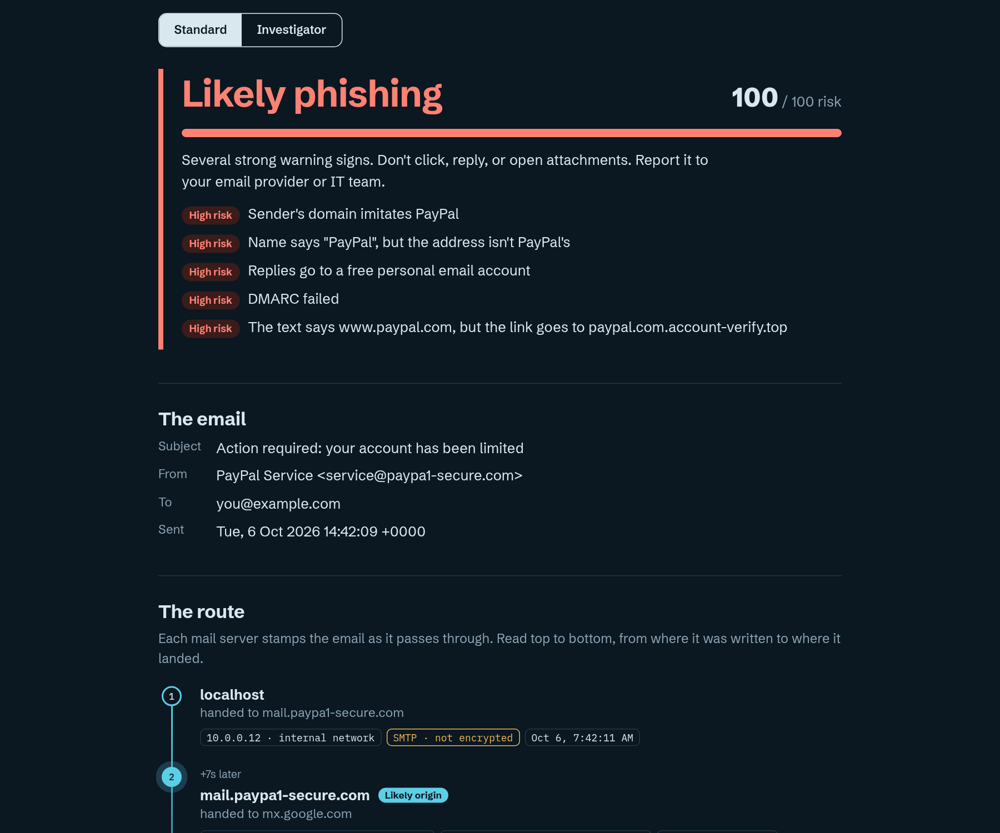
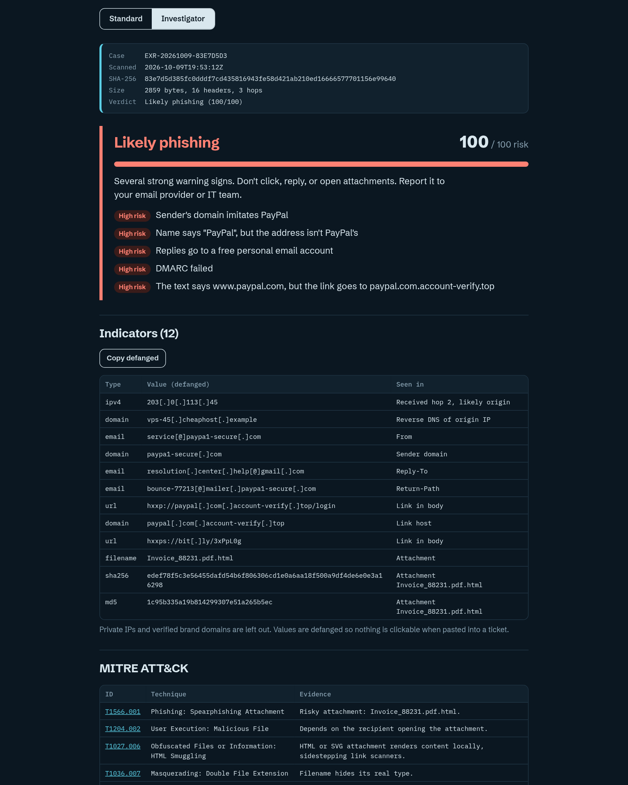

# Email X-Ray

See where a suspicious email really came from.

Email X-Ray takes the raw source of an email (pasted headers, a `.eml` file, or an Outlook `.msg` file) and turns it into a readable investigation: the server-by-server route it took, whether the sender checks out, where every link actually goes, and a plain-English verdict. It runs entirely in the browser. Nothing you paste leaves the page.

**Live demo:** https://r3d-4ct3d.github.io/email-xray/ (full features including the AI second read: https://claude.ai/artifact/TEYtsFe6EdfkbJsN2i8Qak)

| Standard mode | Investigator mode |
|---|---|
|  |  |

## Features

### Standard mode
- **Delivery route.** Rebuilds the path from the `Received` headers, marks the likely origin, shows the delay between hops, and flags timestamps that run backwards (a sign of forged headers).
- **Sender checks.** Display-name spoofing, reply-to hijacks to freemail accounts, lookalike domains (`paypa1`, `arnazon`, `micros0ft-support`), mismatched bounce and Message-ID domains, mass-mailer fingerprints.
- **Authentication.** SPF, DKIM, and DMARC results explained in plain English, including the "DMARC passed, but only for the lookalike domain" trap.
- **Links.** Shown text versus real destination, the `@` trick, raw IP links, shorteners, free hosting, abused TLDs, decoy subdomains.
- **Attachments.** Risky types and double extensions like `Invoice.pdf.html`.
- **Pressure language.** Urgency, threats, gift cards, generic greetings.
- **Risk score** from 0 to 100 with the top reasons.

### Investigator mode
- Case header with case ID, UTC scan time, and SHA-256 of the raw email
- Defanged IOC table (`hxxp://evil[.]top`) with copy, CSV, and STIX 2.1 export
- SHA-256, SHA-1, and MD5 hashes for attachments
- MITRE ATT&CK mapping with the evidence behind each technique
- Raw hop table and raw authentication headers with DKIM selector locations
- AI second read for pretext and social engineering (claude.ai artifact runtime only)
- Downloadable Markdown case report

## Run it locally

No build step. Open `src/index.html` in any modern browser, or serve the folder:

```bash
npx serve src
```

Click **Try a sample phish**, or drag `samples/paypal-lookalike.eml` onto the page.

> The AI second read needs the claude.ai artifact runtime, so other hosts show a link to the claude.ai version instead. Moving it to a backend is Phase 4 in `NEXT_STEPS.md`.

## Project layout

```
email-xray/
  src/index.html        the whole app (HTML, CSS, JS in one file)
  src/vendor/           .msg parser bundle, loaded only when a .msg is opened
  tools/msgreader/      how that bundle is built
  samples/              test emails (.eml)
  docs/                 screenshots and write-ups go here
  NEXT_STEPS.md         roadmap
  CLAUDE.md             context for Claude Code sessions
```

## How to get raw email source

| Client | Steps |
|---|---|
| Gmail (web) | Open email, three-dot menu, **Show original**, **Copy to clipboard** |
| Outlook (web) | Three-dot menu, **View**, **View message source** |
| Apple Mail | **View**, **Message**, **Raw Source** |
| Yahoo Mail | **More**, **View raw message** |
| Outlook (desktop) | Drag the email to your desktop to save a `.msg`, then drop it on the page |

## Limits

- Analysis is static. Links are never visited and attachments are never opened.
- Shortened links can't be expanded and IPs can't be geolocated without a backend (planned).
- Authentication results are read from the receiving server's stamp, not re-verified (planned).
- A clean result is not a guarantee.

## License

MIT
